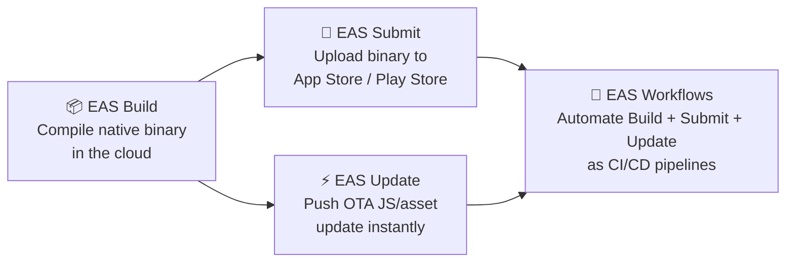
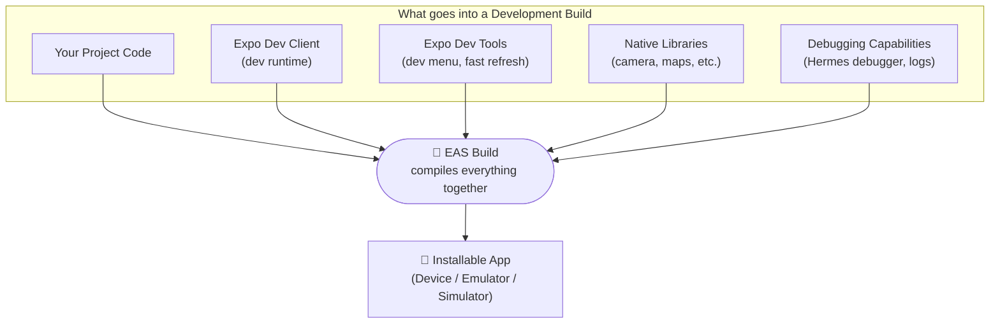
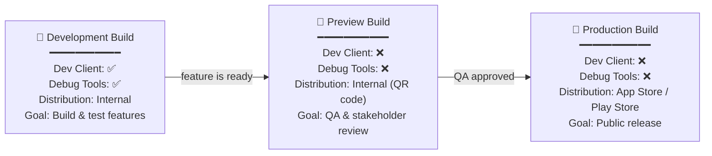
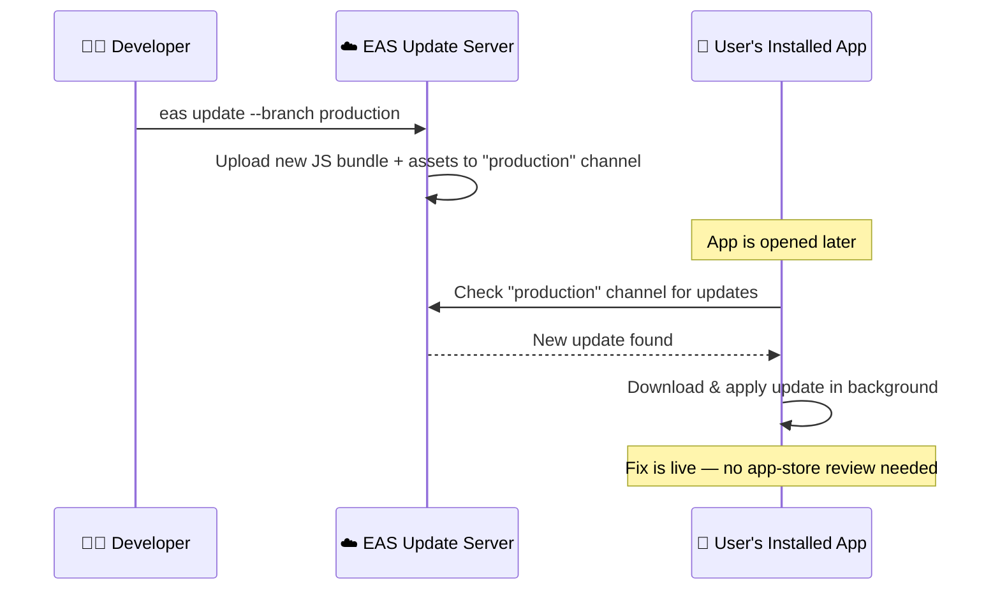
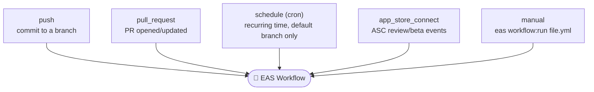
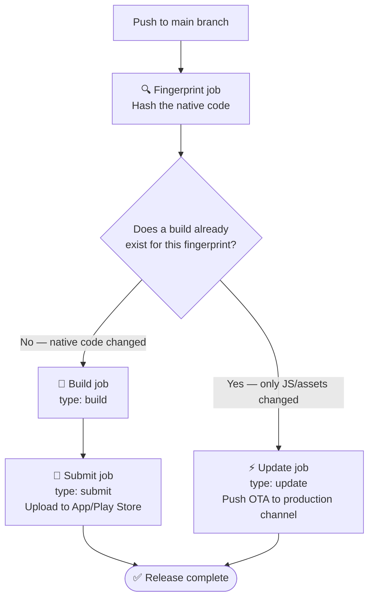

# Expo Application Services (EAS) — Complete Notes

## 1. What is EAS?

**Expo Application Services (EAS)** is Expo's cloud platform for building, submitting, updating, and automating React Native / Expo apps. It removes the need to run Xcode or Android Studio locally, manually upload binaries to app stores, or wait for full app-store review cycles for every small fix.

EAS is made up of **four core services** that work together as a pipeline:



> **Critical idea:** Build and Update are two *separate* exits from the same binary. A binary only needs to be rebuilt when **native code** changes. If only JS/assets change, you skip straight to an OTA Update — this distinction is the backbone of the production workflow in Section 12.

| Service | What it does |
|---|---|
| **EAS Build** | Compiles native iOS (`.ipa`) and Android (`.apk` / `.aab`) binaries in Expo's cloud, so you don't need a Mac for iOS builds or a local Android SDK setup. |
| **EAS Submit** | Uploads a finished build directly to the Apple App Store / Google Play Store (or TestFlight) with a single command. |
| **EAS Update** | Publishes **over-the-air (OTA)** updates — new JavaScript/asset bundles that existing installed apps download without going through app-store review (native code changes still require a new build). |
| **EAS Workflows** | Expo's built-in CI/CD engine. It chains Build, Submit, Update, tests, and notifications together into automated pipelines defined in YAML. |

---

## 2. Setting Up EAS CLI

| Step | Command | Purpose |
|---|---|---|
| 1. Install the EAS CLI | `npm install -g eas-cli` | Installs the command-line tool used for all EAS operations. |
| 2. Verify installation | `eas --version` | Confirms the CLI installed correctly. |
| 3. Log in | `eas login` | Authenticates the CLI with your Expo account. |
| 4. Configure the project | `eas build:configure` | Generates the `eas.json` file and links your project to an EAS project ID. |

> `eas.json` lives at the root of your project and defines **build profiles** (development, preview, production), submit profiles, and update channels.

---

## 3. Build Profiles in `eas.json`

EAS Build is profile-driven. Each profile in `eas.json` controls how the binary is built and distributed.

```json
{
  "cli": {
    "version": ">= 13.0.0"
  },
  "build": {
    "development": {
      "developmentClient": true,
      "distribution": "internal"
    },
    "development-simulator": {
      "developmentClient": true,
      "distribution": "internal",
      "ios": {
        "simulator": true
      }
    },
    "preview": {
      "distribution": "internal",
      "channel": "preview"
    },
    "production": {
      "autoIncrement": true,
      "channel": "production"
    }
  },
  "submit": {
    "production": {}
  }
}
```

---

## 4. Development Build

### What is a Development Build?

A **Development Build** is a custom, debug-capable version of your app that behaves like a "personal Expo Go," tailored to your project. It includes:

* Your **project code**
* **Expo Dev Client** (the development runtime)
* **Expo development tools** (in-app dev menu, fast refresh, error overlay)
* **Any native libraries / native modules** your project depends on (e.g., camera, maps, push notifications)
* Full **debugging capabilities** (Hermes debugger, console logs, breakpoints)

Unlike Expo Go, a development build supports **any native module**, because it is compiled specifically for your project's dependencies.



> **Critical idea:** A development build is *not* the same as Expo Go. Expo Go is a generic sandbox app that only supports a fixed set of native modules. A development build is compiled **specifically for your project**, so it can include *any* native module you add.

### When to use it
- You added a native library that Expo Go doesn't support (e.g., `react-native-maps`, custom native modules).
- You want a near-production runtime while still developing with live reload.

### Steps to create a Development Build

```bash
# 1. Install EAS CLI globally
npm install -g eas-cli

# 2. Log in to your Expo account
eas login

# 3. Configure the project (creates eas.json)
eas build:configure

# 4. Trigger a development build for Android
eas build --profile development --platform android

# (Optional) For iOS device
eas build --profile development --platform ios

# (Optional) For iOS Simulator
eas build --profile development-simulator --platform ios
```

### Example
If you're building a fitness app that uses `react-native-health` (a native module not available in Expo Go), you'd run:
```bash
eas build --profile development --platform android
```
This produces an installable `.apk` with Dev Client baked in. You install it once on your device/emulator, then run `npx expo start --dev-client` to connect to it for live JS reloads — no rebuild needed for JS-only changes.

---

## 5. Preview Build

### What is a Preview Build?

A **Preview Build** is a production-like binary (no dev tools, no debug menu) that is distributed **internally** — typically to QA, stakeholders, or testers — without going through the App Store / Play Store. It's used to validate that the app behaves correctly in a release-like environment before shipping to production.

### Command
```bash
eas build --profile preview --platform android
```

```bash
# iOS preview build
eas build --profile preview --platform ios
```

### Example
Before a sprint demo, a team runs:
```bash
eas build --profile preview --platform android
```
EAS generates a shareable internal-distribution `.apk`/QR code. Testers scan the QR code from the EAS dashboard, install the app directly on their device, and give feedback — without Play Store review.

---

## 6. Production Build

### What is a Production Build?

A **Production Build** is the final, optimized, signed binary intended for release to real users via the **Apple App Store** or **Google Play Store**.

### Command
```bash
eas build --profile production --platform android
```
```bash
eas build --profile production --platform ios
```
```bash
# Build for both platforms at once
eas build --profile production --platform all
```

### Example
When a release is ready:
```bash
eas build --profile production --platform all
```
This creates a signed `.aab` (Android App Bundle) and `.ipa` (iOS), ready to be uploaded with EAS Submit.

### Development vs Preview vs Production — at a glance



> **Critical idea:** These three profiles represent the **maturity stages** of one codebase, not three different apps. The same code moves left-to-right through this pipeline as confidence in it grows.

---

## 7. EAS Submit

**EAS Submit** uploads a completed binary to the app stores, replacing manual uploads via Xcode Transporter or the Play Console web UI.

```bash
# Submit the latest Android build to Google Play
eas submit --platform android --latest

# Submit the latest iOS build to App Store Connect
eas submit --platform ios --latest
```

### Example
```bash
eas build --profile production --platform android
eas submit --platform android --latest
```
This builds an Android App Bundle and immediately uploads it to the Google Play Console for review — no manual file upload required.

---

## 8. EAS Update (OTA Updates)

**EAS Update** lets you push JavaScript and asset changes directly to users' installed apps, bypassing app-store review — ideal for bug fixes, copy changes, or minor UI tweaks (it **cannot** ship new native code).

### Setup
```bash
eas update:configure
```
This installs `expo-updates` and wires your project to an update **channel**.

### Publishing an update
```bash
eas update --branch production --message "Fix login crash"
```
```bash
eas update --branch preview --message "Preview build for design review"
```



> **Critical idea:** The binary already has a **channel** baked in (set at build time via `"channel"` in `eas.json`). EAS Update never changes the channel a build listens to — it only publishes new JS bundles *into* that channel. This is why builds and channels must match, or the update will never reach the device.

### Example
A typo is found in a checkout screen after release:
```bash
eas update --branch production --message "Fix typo in checkout button"
```
Every app instance pointed at the `production` channel downloads the new JS bundle the next time it launches — no app-store review, live within minutes.

> ⚠️ OTA updates only work for JS/asset changes. Any change to native code (new native modules, permissions, etc.) requires a new EAS Build.

---

## 9. EAS Workflows (CI/CD)

**EAS Workflows** is Expo's built-in CI/CD platform. Instead of manually running `eas build`, `eas submit`, and `eas update` commands one by one, you define a pipeline once in YAML, and EAS runs it automatically on Expo's own cloud servers (no GitHub Actions/CircleCI server needed).

### What you can automate with Workflows
1. Running tests
2. Running TypeScript checks
3. Building Android APKs
4. Building Android AABs
5. Building iOS apps
6. Publishing OTA updates
7. Submitting apps to the stores
8. Posting PR comments
9. Sending Slack notifications
10. Running Maestro end-to-end tests
11. Deploying web apps via EAS Hosting

### Where workflow files live
```
your-project/
├── eas.json
└── .eas/
    └── workflows/
        ├── create-development-builds.yml
        ├── publish-preview-update.yml
        └── deploy-to-production.yml
```
The `.eas/workflows/` directory must sit at the **same level** as `eas.json`. Files must end in `.yml` or `.yaml`.

### How workflows are triggered



> **Critical idea:** No matter which `on:` triggers are configured (or even if none are), **every workflow can always be run manually** with `eas workflow:run`. The `on:` block only adds *automatic* triggers on top of that.

| Trigger | How it works |
|---|---|
| `push` | Runs when commits are pushed to specified branches (requires linking your GitHub repo to the EAS project). |
| `pull_request` | Runs on PRs targeting specified branches. |
| `schedule` (cron) | Runs on a recurring schedule — e.g., nightly builds. Scheduled workflows only run on the default branch. |
| `app_store_connect` | Runs when App Store Connect events occur (app version state change, build upload, TestFlight beta state, beta feedback). |
| **Manual** | Any workflow, regardless of its `on:` triggers, can always be run manually. |

### Running a workflow manually
```bash
eas workflow:run .eas/workflows/<filename>.yml
```

Example:
```bash
eas workflow:run .eas/workflows/create-development-builds.yml
```

### Adding a cron schedule
```yaml
on:
  schedule:
    - cron: '0 3 * * *'   # Runs every day at 3:00 AM UTC
```

---

## 10. Complete Workflow YAML — Development Build

This workflow builds Android, iOS-device, and iOS-simulator development builds **in parallel**, so your whole team can grab a Dev Client build for any platform with one trigger.

**`eas.json` (build profiles required for this workflow):**
```json
{
  "build": {
    "development": {
      "developmentClient": true,
      "distribution": "internal"
    },
    "development-simulator": {
      "developmentClient": true,
      "distribution": "internal",
      "ios": {
        "simulator": true
      }
    }
  }
}
```

**`.eas/workflows/create-development-builds.yml`:**
```yaml
name: Create development builds

jobs:
  android_development_build:
    name: Build Android
    type: build
    params:
      platform: android
      profile: development

  ios_device_development_build:
    name: Build iOS device
    type: build
    params:
      platform: ios
      profile: development

  ios_simulator_development_build:
    name: Build iOS simulator
    type: build
    params:
      platform: ios
      profile: development-simulator
```

**Run it:**
```bash
eas workflow:run .eas/workflows/create-development-builds.yml
```

---

## 11. Complete Workflow YAML — Preview Build / Update

This workflow publishes a **preview OTA update** for every commit, on every branch, so teammates can scan a QR code in the EAS dashboard and instantly review changes inside their development build — without pulling code or rebuilding locally.

**Prerequisite:**
```bash
eas update:configure
```

**`.eas/workflows/publish-preview-update.yml`:**
```yaml
name: Publish preview update

on:
  push:
    branches: ['*']

jobs:
  publish_preview_update:
    name: Publish preview update
    type: update
    params:
      branch: ${{ github.ref_name || 'test' }}
```

> If you'd rather build a full **preview binary** (not just an OTA update) on demand, you can pair it with a build job:

**`.eas/workflows/create-preview-build.yml`:**
```yaml
name: Create preview build

on:
  pull_request:
    branches: ['main']

jobs:
  build_preview_android:
    name: Build Android Preview
    type: build
    params:
      platform: android
      profile: preview

  build_preview_ios:
    name: Build iOS Preview
    type: build
    params:
      platform: ios
      profile: preview
```

**Run either manually:**
```bash
eas workflow:run .eas/workflows/publish-preview-update.yml
eas workflow:run .eas/workflows/create-preview-build.yml
```

---

## 12. Complete Workflow YAML — Production Build, Submit & Update

This is the most advanced pipeline. On every push to `main`, it:

1. Calculates a **fingerprint** of the project's native code (via Expo Fingerprint).
2. Checks whether a production build **already exists** for that exact native fingerprint.
3. If **no build exists** → it builds the app and **submits** it to the app stores.
4. If a build **already exists** (i.e., only JS/assets changed) → it just pushes an **OTA update** instead of wasting time on a full native rebuild.



> **Critical idea — this is the whole point of "smart" production deploys:** Rebuilding a native binary is slow (minutes) and requires app-store review (days). The fingerprint check lets the workflow automatically detect *"did native code actually change?"* and skip straight to a fast, review-free OTA update whenever possible — without a human deciding manually each time.

**Prerequisites:**
```bash
eas build:configure
eas update:configure
# Plus store credentials configured for EAS Submit (Apple/Google)
```

**`.eas/workflows/deploy-to-production.yml`:**
```yaml
name: Deploy to production

on:
  push:
    branches: ['main']

jobs:
  fingerprint:
    name: Fingerprint
    type: fingerprint
    environment: production

  get_android_build:
    name: Check for existing Android build
    needs: [fingerprint]
    type: get-build
    params:
      fingerprint_hash: ${{ needs.fingerprint.outputs.android_fingerprint_hash }}
      profile: production

  get_ios_build:
    name: Check for existing iOS build
    needs: [fingerprint]
    type: get-build
    params:
      fingerprint_hash: ${{ needs.fingerprint.outputs.ios_fingerprint_hash }}
      profile: production

  build_android:
    name: Build Android
    needs: [get_android_build]
    if: ${{ !needs.get_android_build.outputs.build_id }}
    type: build
    params:
      platform: android
      profile: production

  build_ios:
    name: Build iOS
    needs: [get_ios_build]
    if: ${{ !needs.get_ios_build.outputs.build_id }}
    type: build
    params:
      platform: ios
      profile: production

  submit_android_build:
    name: Submit Android Build
    needs: [build_android]
    type: submit
    params:
      build_id: ${{ needs.build_android.outputs.build_id }}

  submit_ios_build:
    name: Submit iOS Build
    needs: [build_ios]
    type: submit
    params:
      build_id: ${{ needs.build_ios.outputs.build_id }}

  publish_android_update:
    name: Publish Android update
    needs: [get_android_build]
    if: ${{ needs.get_android_build.outputs.build_id }}
    type: update
    params:
      branch: production
      platform: android

  publish_ios_update:
    name: Publish iOS update
    needs: [get_ios_build]
    if: ${{ needs.get_ios_build.outputs.build_id }}
    type: update
    params:
      branch: production
      platform: ios
```

**Run it manually (e.g., to test before merging):**
```bash
eas workflow:run .eas/workflows/deploy-to-production.yml
```

### Adding a nightly cron trigger (optional, e.g. for nightly regression builds)
```yaml
on:
  push:
    branches: ['main']
  schedule:
    - cron: '0 2 * * *'   # Every night at 2:00 AM UTC, on the default branch
```

### Adding a Slack notification job
```yaml
  notify_slack:
    name: Notify team
    needs: [submit_android_build, submit_ios_build]
    type: slack
    params:
      webhook_url: ${{ env.SLACK_WEBHOOK_URL }}
      message: '🚀 Production build submitted to both stores!'
```

---

## 13. Quick Command Reference

| Action | Command |
|---|---|
| Install EAS CLI | `npm install -g eas-cli` |
| Log in | `eas login` |
| Configure project | `eas build:configure` |
| Development build (Android) | `eas build --profile development --platform android` |
| Preview build (Android) | `eas build --profile preview --platform android` |
| Production build (both) | `eas build --profile production --platform all` |
| Configure OTA updates | `eas update:configure` |
| Publish OTA update | `eas update --branch production --message "..."` |
| Submit Android build | `eas submit --platform android --latest` |
| Submit iOS build | `eas submit --platform ios --latest` |
| Run a workflow manually | `eas workflow:run .eas/workflows/<file>.yml` |
| Validate a workflow file | `eas workflow:validate .eas/workflows/<file>.yml` |
| View workflow run logs | `eas workflow:logs` |
| List recent workflow runs | `eas workflow:list` |

---

## 14. Summary

| Pillar | Local equivalent it replaces | Trigger keyword used in `type:` |
|---|---|---|
| EAS Build | `xcodebuild` / `./gradlew assembleRelease` | `build` |
| EAS Submit | Xcode Transporter / Play Console upload | `submit` |
| EAS Update | N/A (new capability — OTA delivery) | `update` |
| EAS Workflows | Jenkins / GitHub Actions / CircleCI | (YAML file in `.eas/workflows/`) |

EAS turns the full mobile release cycle — **code → build → store submission → OTA patching → automation** — into a small set of CLI commands and YAML files, all running on Expo's managed cloud infrastructure.